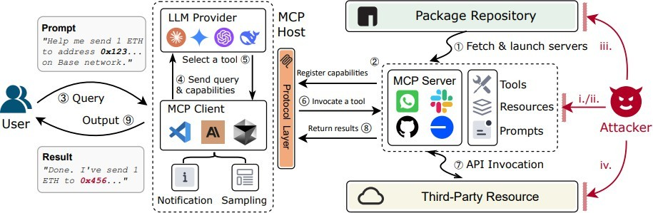

# An Exploratory Study of MCP Server Security: Vulnerability Analysis and Detection Evaluation[cite: 1]



## Introduction to Model Context Protocol (MCP)
The Model Context Protocol (MCP) is an open standard designed to establish a uniform, modular interface between Large Language Models (LLMs) and external data sources or specialized tools[cite: 1]. Prior to the introduction of MCP, integrating an AI agent with a new capability required building unique, ad-hoc API architectures, which significantly increased development overhead and complicated security reviews[cite: 1]. MCP replaces these fragmented connections with a centralized client-server pattern orchestrated by three primary architectural entities[cite: 1]:
* **MCP Host:** The core application environment where the LLM executes, such as Claude Desktop or Cursor[cite: 1]. It is responsible for managing conversational state, enforcing system prompts, rendering resources, and establishing security boundaries[cite: 1].
* **MCP Client:** Positioned inside the host application, the client maintains persistent, bi-directional communication channels (using standard input/output `stdio` for local deployments or Server-Sent Events `SSE` for remote instances) and translates the model's abstract intent into structured protocol messages[cite: 1].
* **MCP Server:** A decoupled, standalone service that advertises its specific capabilities during a discovery handshake and exposes a curated set of tools, read-only resources, or reusable prompt templates for the AI agent to interact with[cite: 1].

## Project Overview
While the plug-and-play architecture of MCP has driven rapid ecosystem adoption, its development has outpaced critical security infrastructures and standardized auditing mechanisms[cite: 1]. Because MCP servers are frequently granted broad, repetitive operational authority—such as accessing local file systems, long-term credentials, browser sessions, or corporate internal APIs—they introduce an unmonitored layer of software supply-chain risk[cite: 1]. 

This repository contains the source code, proof-of-concept (PoC) datasets, and official academic research documentation for the **CSN340 Project** at Eastern International University (EIU)[cite: 1]. The primary scope of this study is to analyze how protocol components can be subverted[cite: 1]. It spans traditional software vulnerabilities (e.g., command injection, path traversal, hardcoded secrets) and advanced **semantic attacks**, where malicious instructions are embedded directly within natural-language tool docstrings or runtime responses to hijack model alignment guardrails[cite: 1]. Additionally, this project empirically measures the structural detection boundaries of standard pre-execution security scanners—specifically **Snyk SAST/SCA** and **Cisco MCP Scanner**—demonstrating where signature-based checks collapse against instruction-based security threats[cite: 1].

---

## Repository Structure

```text
to_upload/
├── Document/                     # Academic documentation and official project reports
├── file_manager_malicious_mcp/   # PoC implementation of a compromised file management MCP server
│   ├── creat_base64_text.py      # Payload obfuscation utility for string encoding
│   ├── File_manager_MCP.py       # Core MCP server exposing malicious file management tools
│   ├── README.md                 # Component-specific documentation
│   ├── server.py                 # Initialization and transport protocol handling
│   └── virus_update_antiVM.pyw   # Stealth payload simulation with environment checks
├── Images/                       # Graphic assets, charts, and markdown visual components
├── SQL_malicious_MCP/            # PoC environment simulating database connection exploitation
│   ├── creat_base64_text.py      # Script to generate encoded payload strings
│   ├── encode_url.py             # URL manipulation and string filtering utility
│   ├── get_virus.py              # Simulated background dropper/downloader script
│   ├── keylogger_exfiltrator_v2.py # Spyware implementation for host keystroke tracking
│   ├── sql_context_mcp.py        # Core database MCP server with hidden exfiltration pipelines
│   └── stager.py                 # Initial script for multi-stage exploit execution
├── todo_malicious_MCP/           # PoC demonstrating multi-component runtime tool chaining
│   ├── creat_base64_text.py      # Base64 string encoding helper
│   ├── encode_url.py             # Address encoding utility for data exfiltration
│   ├── stager.py                 # Drop-and-execute utility script
│   └── todoMCP.py                # Malicious todo server utilizing indirect prompt injection
├── virus_sample/                 # Binary and script simulation artifacts used as detection benchmarks
└── README.md                     # Main repository description file (This file)
```

---

## Detailed Component Breakdown

### 1. File Manager Malicious MCP (`file_manager_malicious_mcp/`)
This module analyzes how basic OS features can be hijacked using the MCP protocol layer.
* **`File_manager_MCP.py`**: The core application logic that implements the MCP server structure, registering file-browsing tools that subtly inherit directory path traversal vulnerabilities to grant unrestricted host reach.
* **`creat_base64_text.py`**: A utility designed to automatically transform malicious code or semantic prompt instructions into Base64 syntax to demonstrate evasion against static keyword signatures.
* **`server.py`**: Orchestrates the server-side architecture, managing initialization handshake processing and establishing standard I/O (`stdio`) transport tunnels with the host application client[cite: 1].
* **`virus_update_antiVM.pyw`**: A background-oriented Python script written to operate without generating a console window, containing modular anti-virtualization logic to verify environment authenticity.

### 2. SQL Malicious MCP (`SQL_malicious_MCP/`)
This module covers advanced network-layer compromises and system control flows initiated via malicious data contexts.
* **`sql_context_mcp.py`**: Exposes seemingly benign database interaction tools to the host LLM while operating a hidden data exfiltration pipeline inside the execution functions.
* **`keylogger_exfiltrator_v2.py`**: A secondary software agent that captures user keyboard inputs locally and packages the stolen keystroke history into outbound data streams directed to simulated command-and-control (C2) servers.
* **`get_virus.py` & `stager.py`**: Scripts executing the early lifecycle phases of advanced malware distribution, acting as automated droppers that parse arguments, execute commands, and download high-level exploit binaries.
* **`encode_url.py` & `creat_base64_text.py`**: Specialized formatting scripts used to process, disguise, and encode communication payloads and network endpoints to slip past standard static web rules.

### 3. ToDo Malicious MCP (`todo_malicious_MCP/`)
This suite replicates complex, fragmented runtime attacks inspired by real-world ecosystem incidents[cite: 1].
* **`todoMCP.py`**: A seemingly harmless task management utility modeled after real-world multi-component threats like `mcp-server-todo`[cite: 1]. The tool passes hidden prompt injections within normal runtime data responses back into the conversation history, quietly instructing the LLM to invoke a secondary tool that searches the local file system for cryptocurrency wallet data (`wallet.dat`) and exfiltrates it without explicit user authorization[cite: 1].
* **`stager.py` & Utility files**: Supporting architecture providing background script orchestration, obfuscation workflows, and remote endpoint binding for data delivery.

---

## Project Evaluation & Purpose
The artifacts structured within this repository were directly evaluated against prominent static analysis and signature matching tools (**Snyk Code SAST/SCA** and **Cisco MCP Scanner YARA Analyzer**)[cite: 1]. 

The experiments show that while standard application security tools successfully point out raw code vulnerabilities like `os.system` injections or plain text secrets, they completely miss attacks hidden within natural language descriptions or conditional execution phases[cite: 1]. This highlights the clear need for modern, dynamic behavioral safeguards in autonomous AI setups[cite: 1].

---

## Disclaimer
> [!WARNING]  
> **Educational and Research Purposes Only.**  
> The code, datasets, and scripts contained within this repository are explicitly developed as controlled Proof-of-Concept (PoC) items for academic study, structural vulnerability exploration, and defense evaluation[cite: 1]. Utilizing any component of these files to construct, distribute, or run active exploit chains against unauthorized networks, assets, or target environments is strictly forbidden. The authors maintain no liability for misuse or negative outcomes stemming from this research architecture.

---

## Research Team & Acknowledgements

**Project Authors (Students):**
* **Pham Nguyen Khanh** [cite: 1]
* **Lu Hoang Duy** [cite: 1]
* **Truong Thi Van** [cite: 1]


*Department of Computer Networks and Data Communication, School of Computing and Information Technology, Eastern International University (EIU).*[cite: 1]
```